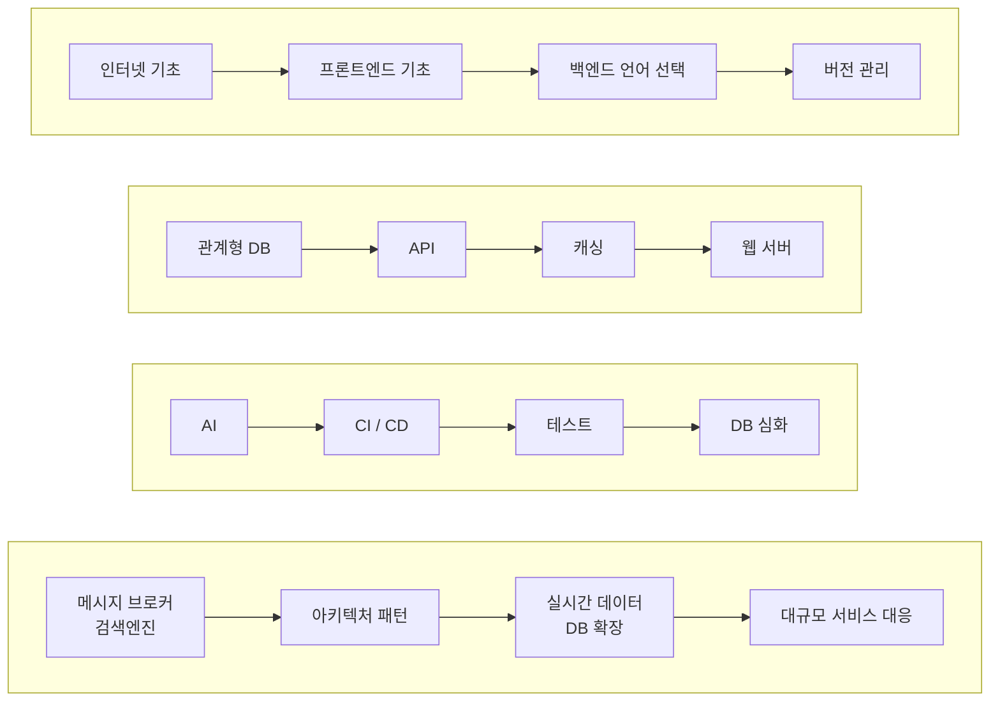
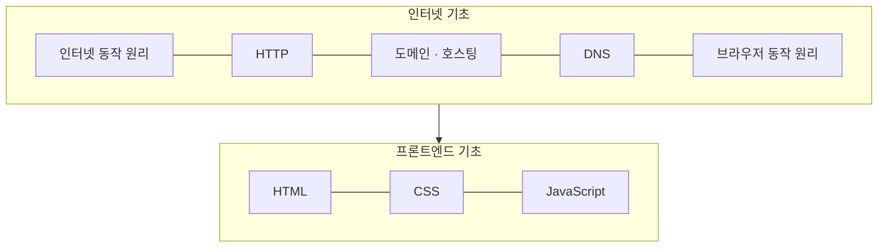
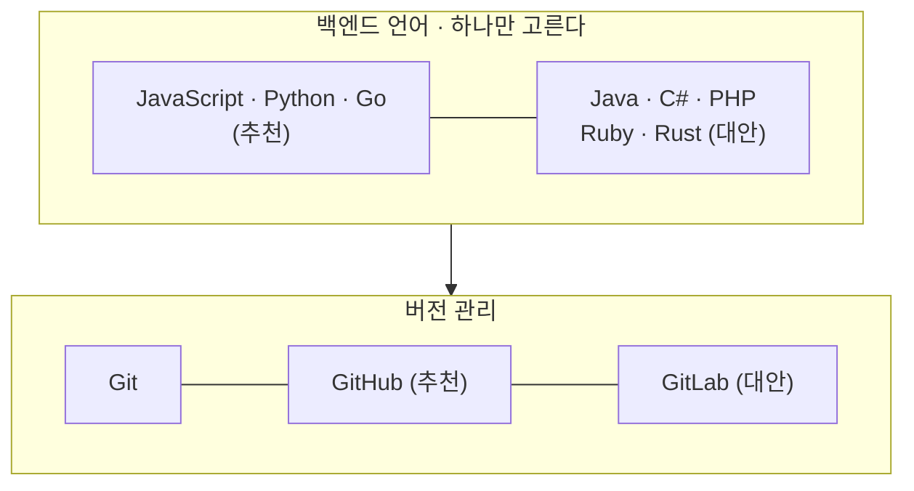
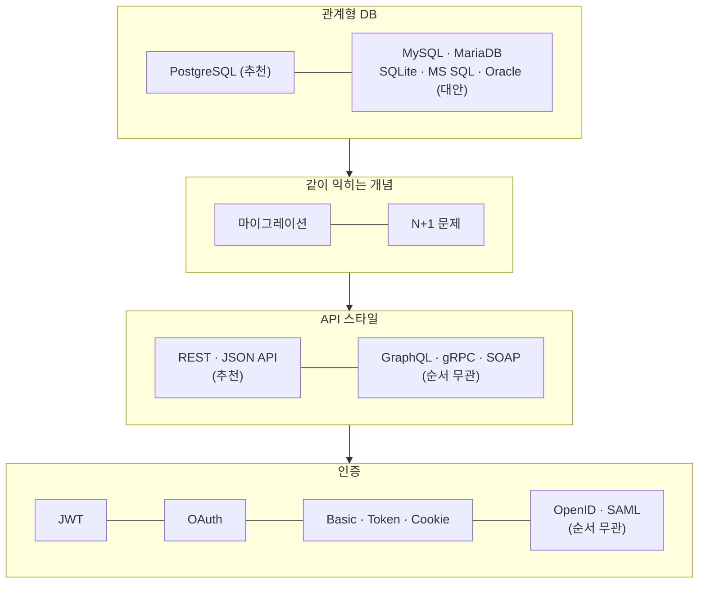
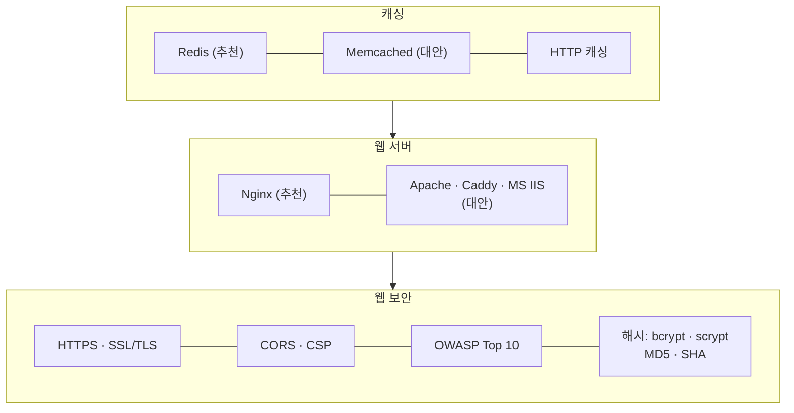
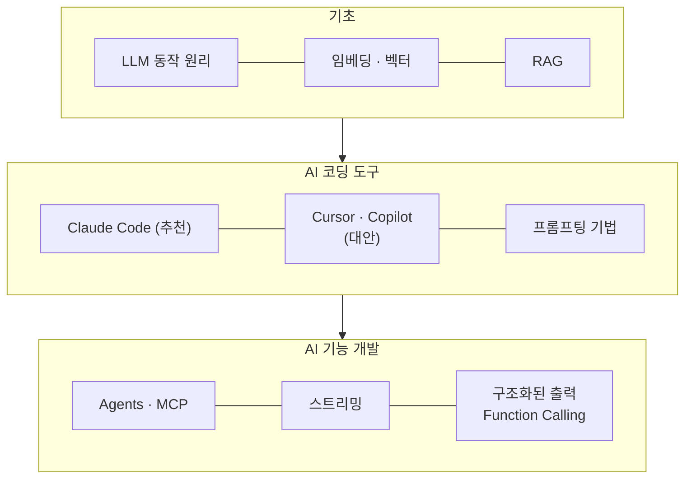
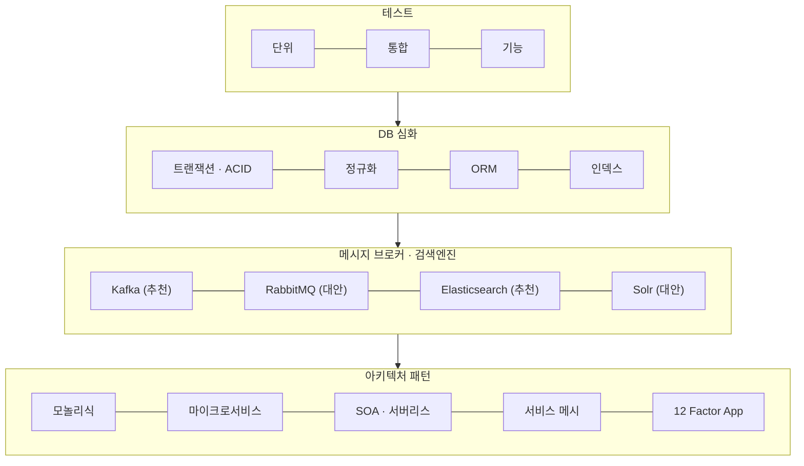
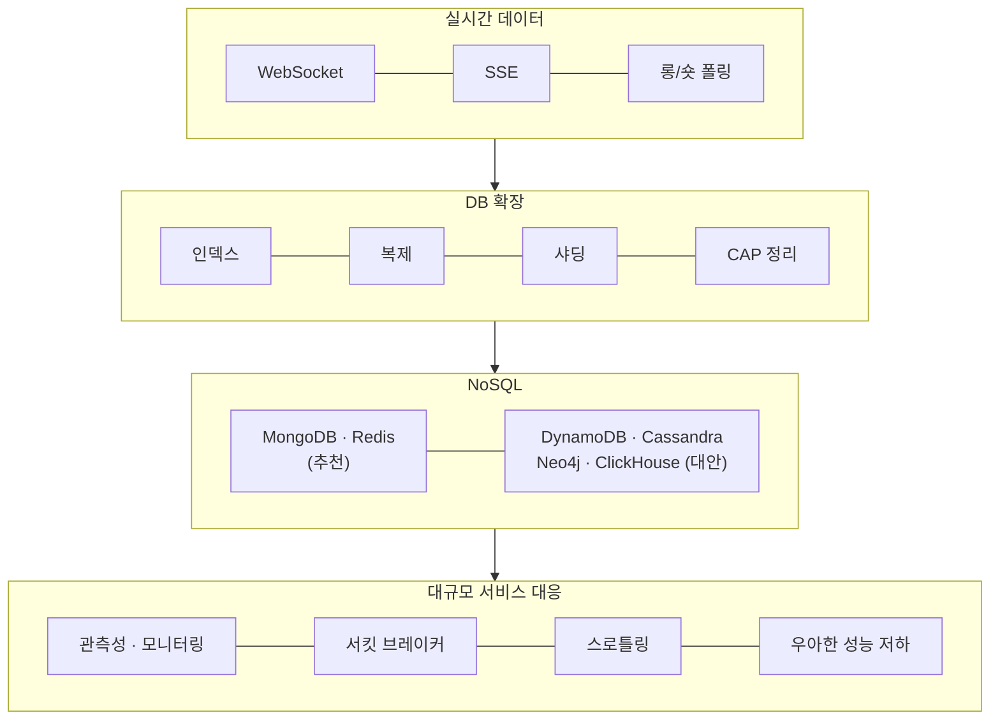
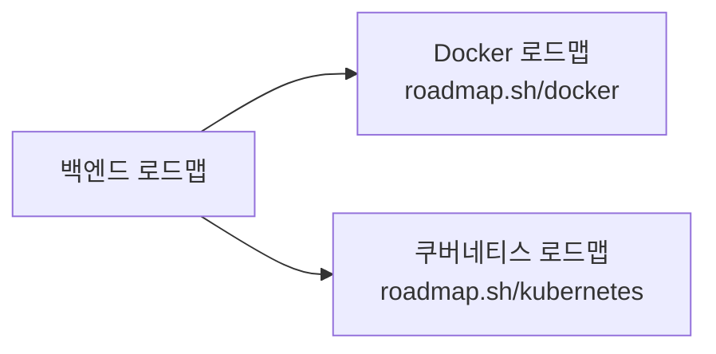

| 색 | 의미 | 개수 |
|---|---|---|
| 🟣 보라 | 추천. 기본값으로 선택한다 | 71개 |
| 🟢 초록 | 대안. 보라색 대신 **택1** | 25개 |
| ⚪ 회색 | 순서 무관 | 11개 |

초록색은 택1이다. MySQL 과 PostgreSQL 을 둘 다 학습할 필요는 없다.

---

전체 흐름
=====
-----

세부 항목을 제외한 큰 단계만 표시한다.

---

1단계 · 기초
=====
-----

백엔드 직군이라도 **HTML·CSS·JavaScript 는 기초 수준까지 포함된다.**
API 의 소비자가 프론트엔드이기 때문이다.

---

2단계 · 언어와 버전 관리
=====
-----

**언어는 하나만 선택한다.** 나열된 항목은 선택지이며 전부 학습하는 대상이 아니다.

---

3단계 · 데이터베이스와 API
=====
-----

관계형 DB 는 **PostgreSQL 만 추천**이고 나머지는 대안이다.
`N+1 문제` 와 `마이그레이션` 은 특정 DB 에 종속되지 않는 공통 개념으로 분류돼 있다.

---

4단계 · 캐싱, 웹 서버, 보안
=====
-----

---

5단계 · AI (2026년 신규)
=====
-----

이전 로드맵에는 없던 영역이다. 배치 위치는 맨 뒤가 아니라 **기본기 직후 · 심화 직전**이다.

**AI 도구의 사용과 AI 기능의 구현은 별도 항목으로 구분된다.**
백엔드 직군의 요구 범위는 후자, 즉 스트리밍·Function Calling 을 이용한 기능 구현이다.

---

6단계 · 심화
=====
-----

---

7단계 · 규모 대응
=====
-----

`관측성(Observability)`, `서킷 브레이커`, `백프레셔`, `스로틀링` 등
장애 대응·복원력 관련 항목이 이 구간에 배치돼 있다.

---

Docker 와 Kubernetes 는?
=====
-----

로드맵을 보면 컨테이너 자리에 Docker·Kubernetes 가 있는데,
이 둘은 **로드맵 안의 학습 항목이 아니라 별도 로드맵으로 빠지는 버튼**이다.

백엔드 로드맵 내부의 학습 항목이 아니라, 각각 독립된 로드맵으로 연결되는 분기점이다.

---

정리
=====
-----

- 기본기 구간은 **인터넷 기초 → 언어 → Git → DB → API → 캐싱 → 웹 서버** 까지다.
- **AI 는 기본기 직후**에 배치돼 있다. 이전 로드맵에는 없던 영역이다.
- **초록색은 택1**이며 전체 학습 대상이 아니다.
- Docker·쿠버네티스는 별도 로드맵으로 분리돼 있다.

---

참고
=====
-----

- [roadmap.sh/backend](https://roadmap.sh/backend) — 원본 로드맵 (2026-02-07 갱신본 기준, 토픽 23개 · 세부 항목 132개)
- [roadmap.sh/docker](https://roadmap.sh/docker) · [roadmap.sh/kubernetes](https://roadmap.sh/kubernetes) — 컨테이너 쪽에서 갈라져 나가는 로드맵
