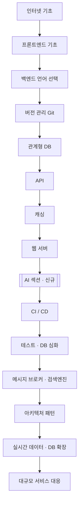
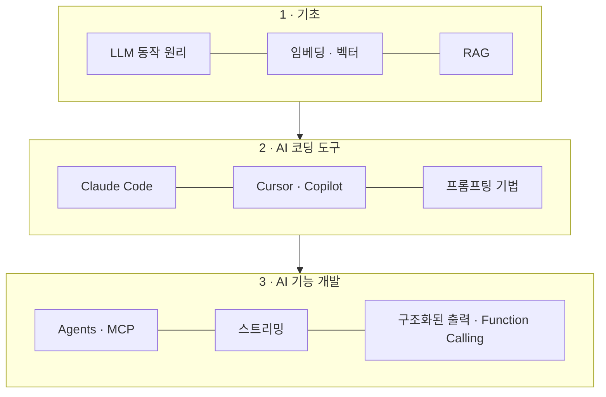
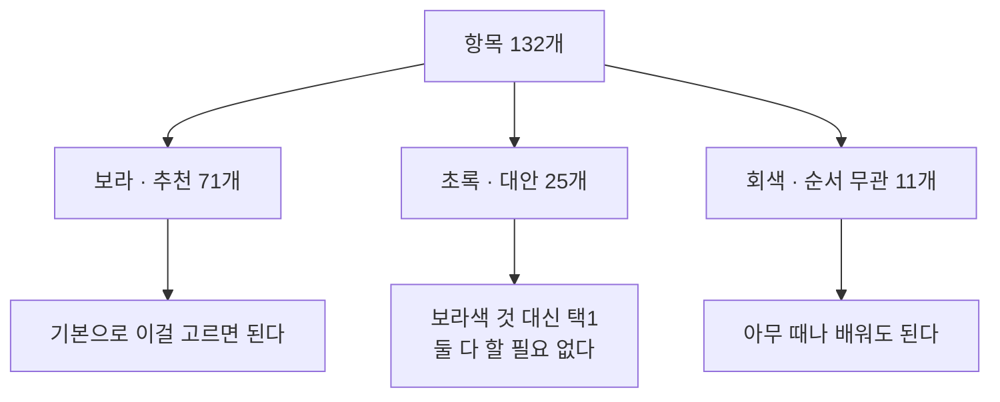

몇 년 전에 저장해둔 백엔드 로드맵 이미지가 있었다.
그걸 다시 꺼내 보다가 문득 궁금해졌다. **지금 roadmap.sh 는 같은 말을 하고 있을까?**

결론부터 쓴다.

- **뼈대는 안 바뀌었다.** 인터넷 기초 → 언어 → Git → DB → API → 캐싱 → 테스트 → CI/CD → 아키텍처. 이 순서는 그대로다.
- **AI 섹션이 통째로 새로 생겼다.** 예전 이미지엔 단 한 칸도 없던 영역이다.
- **뒷부분이 두꺼워졌다.** 실시간 데이터·DB 확장·관측성이 각각 독립 토픽으로 올라왔다.

아래 그림은 전부 [roadmap.sh/backend](https://roadmap.sh/backend) 의 실제 데이터
(2026-02-07 갱신, 토픽 23개·세부 항목 132개)를 기준으로 그렸다.

---

전체 뼈대
=====
-----

먼저 큰 흐름이다. 세부 항목을 다 넣으면 그림이 벽이 되어버려서, **토픽 단위로만** 그렸다.



여기서 눈여겨볼 건 `AI 섹션` 의 **위치**다.
맨 뒤에 부록처럼 붙은 게 아니라, 웹 서버와 CI/CD 사이 —
즉 **기본기를 뗀 직후, 심화로 넘어가기 전**에 들어가 있다.

---

새로 생긴 AI 섹션
=====
-----

예전 이미지와 가장 크게 갈리는 지점이다. 이 영역만 따로 그리면 이렇다.



중요한 건 **도구를 쓰는 것과 AI 기능을 만드는 것이 분리돼 있다**는 점이다.
`Cursor 를 쓴다` 와 `스트리밍·Function Calling 으로 기능을 만든다` 는 다른 칸에 있다.
백엔드 개발자에게 요구되는 건 결국 **뒤쪽**이다.

---

색깔이 곧 우선순위다
=====
-----

로드맵의 색은 장식이 아니라 **분류**다. 실제 데이터에 그대로 들어 있다.



이걸 모르면 로드맵이 **'다 해야 하는 목록'** 으로 보인다.
초록색은 **택1** 이다. MySQL 과 PostgreSQL 을 둘 다 파야 하는 게 아니다.

참고로 **Docker 와 Kubernetes 는 이 로드맵 안의 항목이 아니다.**
각각 독립된 로드맵으로 빠지는 **버튼**이라, "여기서 갈라져 나가라"는 표시에 가깝다.

---

Mermaid 를 이 블로그에 붙이면서
=====
-----

한 가지 짚고 갈 게 있다.
**GitHub Pages 는 ` ```mermaid ` 펜스를 자동으로 렌더해주지 않는다.**

`github.com` 저장소 화면에서 마크다운을 볼 때 다이어그램이 그려지는 건 맞다.
하지만 그건 GitHub 의 마크다운 뷰어가 해주는 것이고,
**Jekyll 로 빌드해서 배포하는 블로그는 경로가 다르다.**
Jekyll(kramdown)은 그냥 이렇게 내보낸다.

```html
<pre><code class="language-mermaid">flowchart TD ...</code></pre>
```

그래서 스크립트를 붙여주지 않으면 다이어그램이 아니라 **소스 코드가 그대로 노출된다.**
레이아웃에 이 정도만 넣으면 된다.

```html

<script type="module">
  import mermaid from 'https://cdn.jsdelivr.net/npm/mermaid@11.17.0/dist/mermaid.esm.min.mjs';

  document.querySelectorAll('code.language-mermaid').forEach((code) => {
    const div = document.createElement('div');
    div.className = 'mermaid';
    div.textContent = code.textContent;
    code.closest('pre').replaceWith(div);
  });

  mermaid.initialize({ startOnLoad: false });
  await mermaid.run();
</script>

```

`page.mermaid` 로 감싼 이유는 **필요한 글에서만 불러오기 위해서**다.
모든 페이지에서 CDN 스크립트를 받아올 이유가 없다.
쓰는 쪽은 프론트매터에 한 줄만 넣으면 된다.

```yaml
mermaid: true
```

**버전을 `@11` 이 아니라 `@11.17.0` 으로 박아둔 것도 의도**다.
`@11` 로 두면 jsDelivr 가 요청 시점의 최신 11.x 를 내려준다. 편해 보이지만,
**그 자바스크립트는 내 블로그에서 그대로 실행된다.** 언젠가 올라올 11.x 를 미리 검토할 방법이 없으니
버전을 고정해두고, 올릴 때 커밋으로 올려 diff 를 보는 편이 낫다.

`mermaid.initialize()` 에 **테마를 지정하지 않은 것도 의도**다.
`theme: 'dark'` 를 주면 노드 배경은 밝은 색 그대로인데 글자만 밝아져서
다크 모드에서 오히려 대비가 무너진다. 기본값이 양쪽 모두에서 무난하다.

---

정리
=====
-----

- 예전에 받아둔 로드맵 이미지가 **틀린 건 아니다.** 뼈대는 지금도 유효하다.
- 다만 **AI 영역이 통째로 비어 있다.** 그리고 그 자리는 부록이 아니라 기본기 바로 다음이다.
- 로드맵을 볼 땐 **색을 먼저 본다.** 초록은 택1이지 전부 해야 할 목록이 아니다.

로드맵은 체크리스트가 아니라 지도에 가깝다.
다 밟아야 하는 게 아니라, **지금 내가 어디쯤 서 있는지** 확인하는 용도로 보는 게 맞다고 생각한다.
