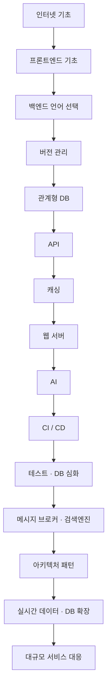
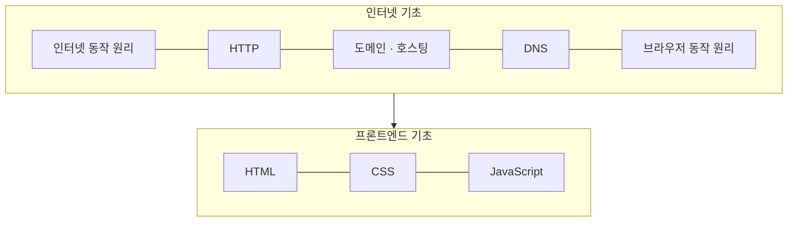
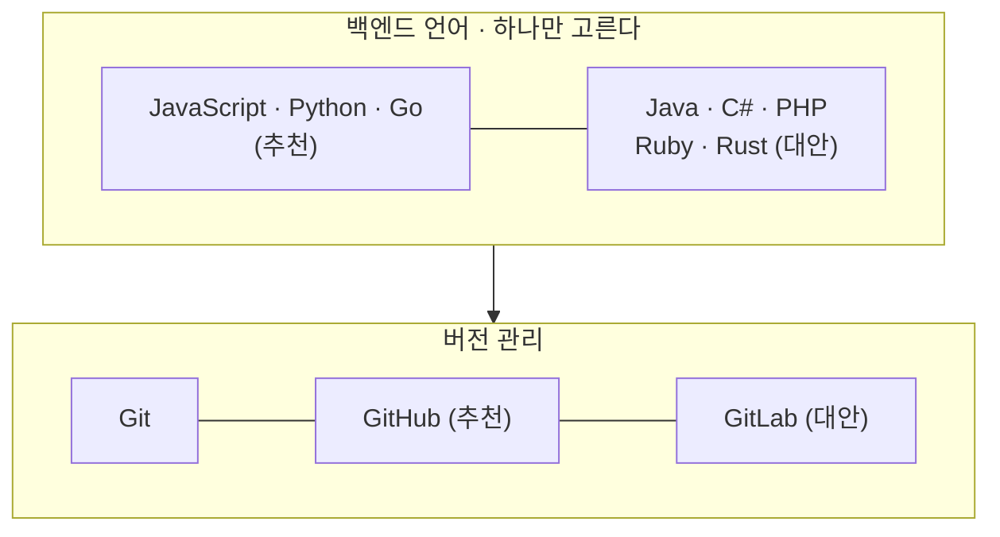
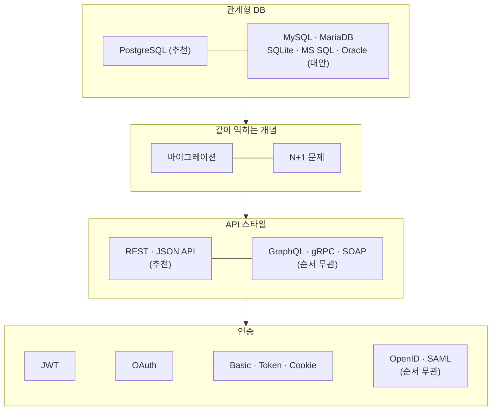
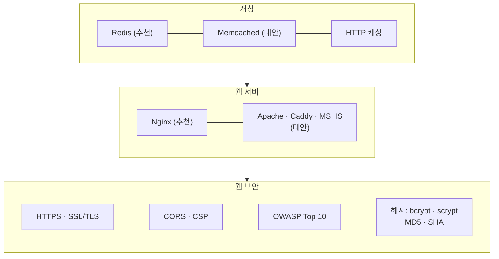
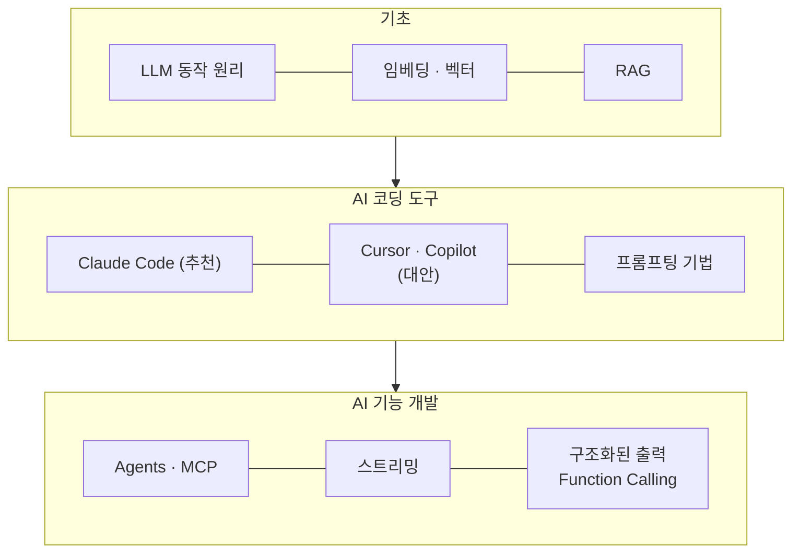
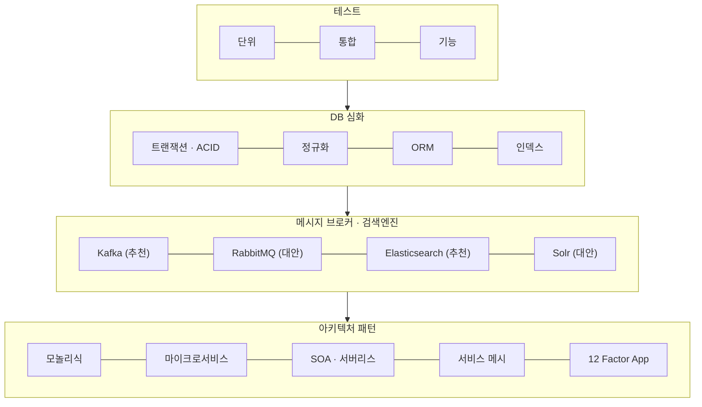
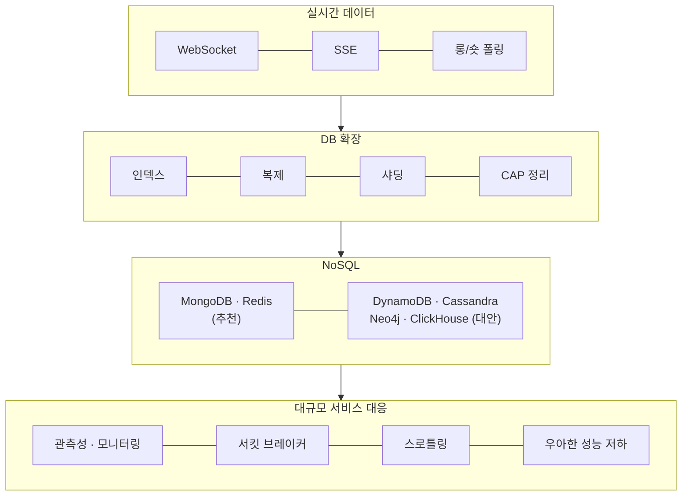
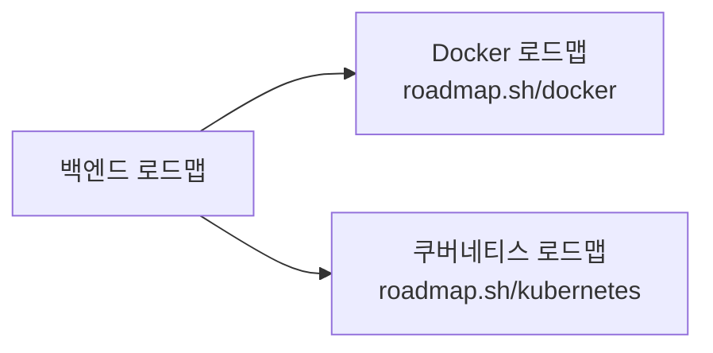

[roadmap.sh/backend](https://roadmap.sh/backend) 의 백엔드 개발자 로드맵을 그대로 옮겨 그렸다.
원본은 가로로 넓은 한 장짜리 마인드맵이라 화면에서 훑기가 불편해서, **단계별로 쪼개서** 정리했다.

기준 데이터는 2026-02-07 갱신본이고 **토픽 23개 · 세부 항목 132개**다.

먼저 색부터 짚고 간다. 로드맵의 색은 장식이 아니라 **분류**다.

| 색 | 의미 | 개수 |
|---|---|---|
| 🟣 보라 | 추천 — 기본으로 이걸 고르면 된다 | 71개 |
| 🟢 초록 | 대안 — 보라색 대신 **택1**, 둘 다 할 필요 없다 | 25개 |
| ⚪ 회색 | 순서 무관 — 아무 때나 배워도 된다 | 11개 |

이걸 모르면 로드맵이 **'다 해야 하는 목록'** 으로 보인다.
초록색은 택1이다. MySQL 과 PostgreSQL 을 둘 다 파야 하는 게 아니다.

---

전체 흐름
=====
-----

세부 항목을 다 넣으면 그림이 벽이 되므로, 큰 단계만 먼저 본다.

---

1단계 · 기초
=====
-----

백엔드를 하더라도 **HTML·CSS·JS 는 기초까지는 본다.**
내가 만든 API 를 결국 프론트가 쓰기 때문이다.

---

2단계 · 언어와 버전 관리
=====
-----

여기가 초보자가 가장 많이 헤매는 지점인데, **언어는 하나만 고르면 된다.**
로드맵이 여러 개를 나열한 건 선택지를 보여준 것이지 다 하라는 뜻이 아니다.

---

3단계 · 데이터베이스와 API
=====
-----

DB 는 **PostgreSQL 하나가 추천**이고 나머지는 전부 대안이다.
`N+1 문제` 가 세부 항목으로 따로 박혀 있는 게 눈에 띈다. 그만큼 자주 터진다는 뜻이다.

---

4단계 · 캐싱, 웹 서버, 보안
=====
-----

---

5단계 · AI (2026년 신규)
=====
-----

예전 로드맵에는 **한 칸도 없던 영역**이다.
위치도 눈여겨볼 만한데, 맨 뒤 부록이 아니라 **기본기 직후 · 심화 직전**에 들어가 있다.

**도구를 쓰는 것과 AI 기능을 만드는 것이 분리돼 있다.**
`Cursor 를 쓴다` 와 `스트리밍·Function Calling 으로 기능을 만든다` 는 다른 칸이고,
백엔드 개발자에게 요구되는 건 결국 뒤쪽이다.

---

6단계 · 심화
=====
-----

---

7단계 · 규모 대응
=====
-----

마지막 칸이 요즘 로드맵에서 눈에 띄게 두꺼워진 부분이다.
`관측성(Observability)`, `서킷 브레이커`, `백프레셔` 같은 항목이 새로 올라왔다.

---

Docker 와 Kubernetes 는?
=====
-----

로드맵을 보면 컨테이너 자리에 Docker·Kubernetes 가 있는데,
이 둘은 **로드맵 안의 학습 항목이 아니라 별도 로드맵으로 빠지는 버튼**이다.

"여기서 갈라져 나가라"는 표시에 가깝다. 그만큼 각각이 하나의 큰 주제라는 뜻이다.

---

정리
=====
-----

- 뼈대는 **인터넷 기초 → 언어 → Git → DB → API → 캐싱 → 웹 서버** 까지가 기본기다.
- **AI 가 기본기 바로 다음**에 들어왔다. 예전 로드맵에는 없던 영역이다.
- 색을 먼저 본다. **초록은 택1**이지 전부 해야 할 목록이 아니다.
- Docker·쿠버네티스는 각자 다른 로드맵으로 빠진다.

로드맵은 체크리스트가 아니라 지도에 가깝다.
다 밟아야 하는 게 아니라, **지금 내가 어디쯤 서 있는지** 확인하는 용도로 보는 게 맞다고 생각한다.
