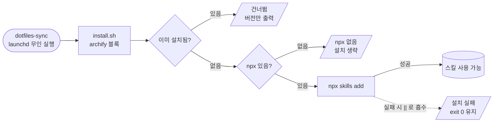

## 결론부터

- 정보량은 **같았다** — 노드 9개, 화살표 8개
- 차이는 **검증**이다. Archify는 선이 겹치면 반려하고, Mermaid는 그냥 그린다
- 대신 Archify는 **812KB**, Mermaid는 2.4KB + CDN

아래에 같은 도식을 두 방식으로 나란히 놓았다. 직접 비교해보시면 된다.

## 소재 — dotfiles 설치 스크립트의 분기

`install.sh` 에 다이어그램 도구를 설치하는 블록을 넣었다.
무인 실행(launchd)에서도 죽지 않아야 해서 가드가 두 겹이다.

- 이미 설치돼 있으면 건너뛴다 — 매번 네트워크를 타지 않도록
- `npx` 가 PATH에 없으면 생략한다 — launchd 환경엔 nvm이 안 잡힌다
- 설치가 실패해도 `||` 로 받아 스크립트 전체를 죽이지 않는다

이 분기를 그림으로 그리면 아래와 같다.

### Mermaid로 그린 것



코드 9줄이다. 텍스트라 글 고치듯 고친다.

### Archify로 그린 것

<div class="archify"
     data-src="/assets/diagrams/archify-install-block.html"
     style="--archify-h: 700px">
</div>

레인 4개로 나뉘고, <kbd>/</kbd> 로 노드를 검색하고,
<kbd>T</kbd> 로 테마를 바꿀 수 있다. 노드를 클릭하면 상·하류가 추적된다.

## 실측 비교

브라우저로 직접 띄워 잰 값이다.

| | Mermaid | Archify |
|---|---|---|
| 노드 / 화살표 | 9 / 8 | **9 / 8** |
| 소스 | 9줄 | JSON 40줄 |
| 렌더 크기 | 1600 × 384 | 1390 × 990 |
| 파일 | 2.4KB | 812KB |
| 외부 의존 | mermaid CDN | **0개** |
| 겹침 검사 | 없음 | 있음 |

**정보량이 같다**는 게 핵심이다. Archify가 더 깊어 보이는 건
lane·phase·group 같은 배치 장치와 하단 카드 때문이지, 내용이 많아서가 아니다.

높이 차이도 같은 이유다. Mermaid는 `LR`로 한 줄에 늘어놓고,
Archify는 4개 레인으로 층층이 쌓는다.

## 겹침을 기계가 잡는다는 것

Archify로 그릴 때 1차에 반려당했다.

```
[composition/ambiguous-corridor] edges[3] "npx-install" 이
edges[6] "present-skip" 과 55px 회랑을 공유함 (최소 8px)
좌표 [486,385] -> [486,440]
```

두 화살표가 같은 `x=486` 세로줄로 내려가 시각적으로 합쳐진다는 뜻이다.
**픽셀 좌표까지 찍어준다.** 그 뒤 과정이 아래 도식이다.

<div class="archify"
     data-src="/assets/diagrams/archify-repair-loop.html"
     style="--archify-h: 680px">
</div>

- 1차 — `bias` 조정 → 변화 없음. 이 라우트는 bias를 안 본다
- 2차 — `channelX` 조정 → 다른 에러로 이동
- 3차 — `fromSide`/`toSide` 추가 → 여전히 실패
- 4차 — **기하 조정을 포기**하고 노드를 `col 3`에서 `col 2`로 옮김 → 통과

배울 점은 4차에 있었다. 스킬 문서에 이런 규칙이 있다.

> 2라운드 연속으로 오류 수가 개선되지 않으면 멈추고 진단을 그대로 보고하라.

그 지점에서 원인이 드러났다. **선이 겹친 것은 증상이고, 원인은 배치였다.**
같은 레인의 두 노드가 나란히 예외 레인으로 떨어지니 겹칠 수밖에 없었다.
기하를 만지작거린 세 번은 전부 헛수고였다.

Mermaid였다면 이 겹침을 아무도 안 알려준다. 눈으로 보고 알아채야 한다.
글은 한 번 올리면 남는데, 겹친 채로 남는다.

## 블로그에 붙일 때 걸린 문제

Archify 산출물은 iframe이라 **다크모드가 어긋난다.**

이 블로그의 테마 버튼은 `body.dark-theme` 클래스로 동작하는데,
iframe 안쪽에서는 그 클래스를 볼 수 없다. 넘겨주지 않으면 뷰어가 OS 설정을 따라가
어두운 페이지에 흰 도식이 뜬다.

`_sass/diagram.scss` 첫머리에 이미 같은 내용이 적혀 있었다.

> `` 로 넣으면 SVG 안에서 페이지의 다크 여부를 알 수 없다.
> 어두운 페이지에 흰 도식이 뜨는 문제가 실제로 있었다.

**인라인 SVG로 옮기며 한 번 겪은 문제가 iframe에서 그대로 재발한 것이다.**
해결은 블로그 안에 선례가 있었다. 댓글(giscus)이 같은 문제를 iframe에서 풀고 있다.

- Archify 뷰어는 주소의 `?theme=` 를 localStorage·OS설정보다 **먼저** 본다
- 테마 버튼을 누르면 `iframe.src` 를 갈아끼운다
- 로드는 `IntersectionObserver` 로 미룬다 — 812KB를 글 첫 로딩에 받지 않는다

색도 맞춰야 했다. 기본 팔레트가 Slate 계열(`#020617`, 강조 초록)이라
이 블로그(`#0d1117`, 강조 파랑) 본문에 나란히 두면 도식만 따로 논다.

산출물에 `<style>` 한 덩이를 덧대는 후처리 스크립트를 두고,
`_sass/vars.scss` 와 같은 값으로 토큰을 덮어썼다.
스킬 자체를 고치지 않으므로 업스트림 업데이트와 충돌하지 않는다.
같은 스크립트로 저자용 컨트롤(프리셋·모션·프레젠테이션·내보내기)도 숨긴다 —
글 안에 박히는 도식에는 쓸 일이 없고, 탐색용 버튼만 남기면 충분하다.

실측으로 확인했다. 도식이 화면 밖(2824px 아래)일 때 iframe은 0개,
스크롤하니 붙었다. 테마 전환 시 `?theme=light` → `?theme=dark` 로 바뀌었다.

## 그래서 언제 뭘 쓰나

기존 인라인 SVG 189개는 그대로 둔다. 새로 까는 레인이지 대체가 아니다.

| 쓰는 곳 | 도구 |
|---|---|
| 본문 중간의 짧은 설명 도식 | 인라인 SVG |
| 코드 펜스로 빠르게 | Mermaid |
| 독자가 탐색해야 하는 큰 도식 | Archify |

셋째 줄이 이번에 생겼다. 노드가 20개를 넘거나 경로를 따라가며 봐야 하는 도식,
그리고 **겹침을 기계가 잡아줘야 할 만큼 복잡한 것**에만 쓴다.

쓰는 법은 프론트매터 한 줄과 본문 한 줄이다.

```markdown
---
archify: true
---


```

## 정리

- 같은 도식에서 **정보량은 동일**했다 — 9노드 8엣지
- 차이는 검증이다. Archify는 픽셀 단위로 겹침을 잡고 수정 가능한 항목을 같이 준다
- 대가는 크기(812KB)와 작성 비용(JSON + 검증 루프)이다
- **기하를 만지기 전에 배치를 의심하라** — 세 번 헛발질하고 배웠다

Mermaid를 버릴 이유는 없다. 이 글의 첫 도식도 Mermaid다.
